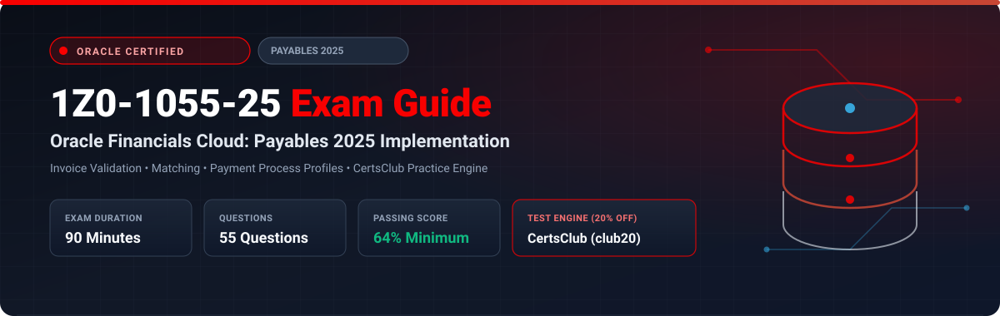

  

# Oracle Financials Cloud: Payables 2025 Implementation Professional (1Z0-1055-25) Exam Study Guide & Practice Test Resource Portal

[-f80000?style=for-the-badge&logo=oracle&logoColor=white)](https://education.oracle.com/)

[-28a745?style=for-the-badge&logo=shield)](https://www.certsclub.com/oracle/)

---

## 1. Exam Overview & Candidate Profile

The **Oracle Financials Cloud: Payables 2025 Implementation Professional (1Z0-1055-25)** exam certifies expertise in implementing and configuring Oracle Fusion Cloud Payables. Topics tested include Business Unit Common Options, Supplier configurations, Purchase Order matching rules (2-way, 3-way, 4-way), Invoice validation and holds, Payment Process Profiles, Electronic Funds Transfer (EFT), and Period Close reconciliation with General Ledger.

Passing 1Z0-1055-25 awards the **Oracle Financials Cloud: Payables 2025 Certified Implementation Professional** credential.

### Target Candidate Profile & Career Roles
* **Payables Functional Implementation Consultants**
* **Procure-to-Pay (P2P) Systems Architects**
* **Financial Operations & Disbursement Leads**

---

## 2. Key Exam Specifications

| Parameter | Official Specification |
| :--- | :--- |
| **Exam Code** | 1Z0-1055-25 |
| **Exam Title** | Oracle Financials Cloud: Payables 2025 Implementation Professional |
| **Associated Credential** | Oracle Financials Cloud: Payables 2025 Certified Implementation Professional |
| **Duration** | 90 Minutes |
| **Number of Questions** | 55 Questions |
| **Passing Score** | 64% |
| **Question Format** | Multiple Choice (Single and Multiple Select) |
| **Delivery Vendor** | Pearson VUE / Oracle University Online Remote Proctoring |
| **Recommended Practice Test Engine** | **[1Z0-1055-25 Practice Test - CertsClub](https://www.certsclub.com/oracle/)** (Coupon: `club20` for 20% off) |

---

## 3. Official Blueprint & Exam Domain Breakdown

| Domain Code | Domain Title | Weighting | Key Competencies Covered |
| :--- | :--- | :---: | :--- |
| **1.0** | **Payables Configuration & Common Options** | **20%** | Common Options for Payables and Procurement, Invoice options, Payment options, Financials system options. |
| **2.0** | **Suppliers & Supplier Site Architecture** | **20%** | Supplier creation, Site assignments, Procurement vs Payables BU, Bank accounts, Supplier portal. |
| **3.0** | **Invoicing, Matching & Holds** | **25%** | Standard and Prepayment invoices, 2-way / 3-way / 4-way PO matching, Invoice tolerances, Hold resolution. |
| **4.0** | **Payments & Electronic Processing** | **20%** | Payment Process Requests (PPR), Payment Process Profiles (PPP), Formats, Bank disbursements. |
| **5.0** | **Accounting & Period Close** | **15%** | Create Accounting, Subledger Accounting rules, Payables to GL reconciliation report, Withholding tax. |

---

## 4. Scenario-Based Demo Question & Explanation

### Question 1: 3-Way Invoice Matching
**Scenario:** A company enforces 3-way matching on physical goods purchases. An invoice is entered for 10 units, matching Purchase Order PO-1001. The PO indicates 10 units were ordered, but the warehouse receipt record shows only 8 units have been received so far.

What happens when the Payables invoice validation process runs?

A) The invoice is automatically canceled.  
B) The invoice is validated successfully because the quantity matches the PO.  
C) A **Quantity Billed** system hold is placed on the invoice because billed quantity exceeds received quantity.  
D) The payment is automatically scheduled for 8 units.  

**Correct Answer:** **C**

**Detailed Explanation:**
* Under 3-way matching, invoice validation compares Quantity Invoiced against both Quantity Ordered (PO) and Quantity Received (Receipt). Because billed quantity (10) exceeds received quantity (8), Oracle Payables applies a **Quantity Billed Hold**, preventing payment until the remaining 2 units are received or the hold is resolved.

---

## 5. Recommended Preparation Strategy & Practice Testing Engine

1. **Practice Procure-to-Pay Matching:** Create POs, receipts, matched invoices, and execute payment process requests.
2. **Practice with Full-Length Mock Exams:** Use **[CertsClub Oracle 1Z0-1055-25 Practice Tests](https://www.certsclub.com/oracle/)**.
   * Comprehensive questions on matching rules, payment process profiles, and SLA.
   * Enter discount coupon code **`club20`** at checkout on [CertsClub](https://www.certsclub.com/oracle/) for an immediate 20% discount.

---

## 6. Official Documentation & References

* [Oracle Financials Cloud Payables Documentation](https://docs.oracle.com/en/cloud/saas/financials/payables/)
* [Oracle University 1Z0-1055-25 Exam Details](https://education.oracle.com/)
* [CertsClub 1Z0-1055-25 Practice Engine](https://www.certsclub.com/oracle/)
